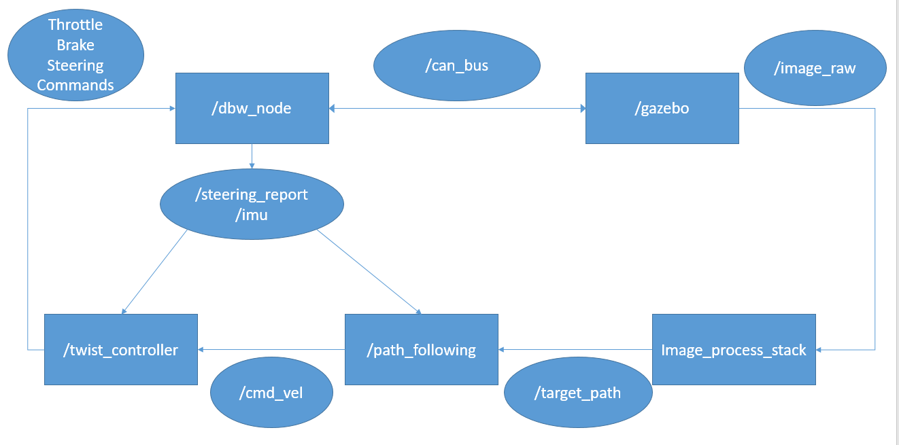

# Hacking_dbw_mkz

## 1. Introduction
This is a personal practice to hack into Dataspeed ADAS Development Vehicle Kit, which is a semi-open-source project for developing 
self-driving cars and their simulation using ROS and Gazebo.

More basic information and guides to setup the environments can be found in the [official sites](https://bitbucket.org/DataspeedInc/dbw_mkz_ros) and their [official documents](https://bitbucket.org/DataspeedInc/dbw_mkz_ros/src/4f3e09f7c23e6cb3672092d3c194569a109d884d/ROS_SETUP.md?fileviewer=file-view-default).

However, there is limited guides to make the platform work for us. 
Firstly, it takes some time to understand the structure of the system from rqt_graph or source code directly, especially for a beginner like me. Besides, as observed in the source code [site](https://bitbucket.org/DataspeedInc/dbw_mkz_ros/src) (2018.11.23), the source code of the package "dbw_mkz_vision_sim" is not available yet.

This project starts from the most sophisticated demo provided officially from Dataspeed, i.e. "lane_keep_demo.launch" where a car is controlled to keep in lane.

Currently, the project contain code for :

    1. Semi-customed launchers and world files that modify the original world or using my modified node.
    2. A simple implementation for twist_controller (the controller that outputs steering, throttle and braking commands). Source codes for the official twist_controller is actually open source.
    3. A MPC implementation for path_follower (the controller that takes in target_path and outputs twist command to twist_controller).
    4. A prototype lane detector that produce target_path. Notice: It is not robust enough and it may fail sometimes.

The basic structure of the demo launch file can be summarized by the following picture.

The /gazebo node is the simulation platform and communicate with the other softwares through CAN bus topics and image topics(/vehicle/image_raw). The /dbw_node node is an officially provided node that output sensor messages and receive control messages. We got to customized our own image_processing, path_following and controller codes.

A sample video running "./launch/vision_launcher.launch" can be found on https://www.youtube.com/watch?v=X9yR8VVwhtg.

TODO:

    1. Improve system's robustness, especially for lane detector.
    2. Move on to my next project using the controlling stacks here.

Notice:

1. Due to the change of the officially provided source code after version 1.1.0 , the struture of the officially supported nodes have changed. The structure of the repo still works (12/23/2018), but may be depreciated further in the future. The original version I was using can be found in [https://bitbucket.org/DataspeedInc/dbw_mkz_ros/downloads/ADAS_Kit_FORD_20181026.zip](https://bitbucket.org/DataspeedInc/dbw_mkz_ros/downloads/ADAS_Kit_FORD_20181026.zip).

## 2. Dependencies
The path_following node is actually implemented similar to the Udacity [MPC project](https://github.com/udacity/CarND-MPC-Project) in self-driving car Nanodegree program. 

More importantly, install ipopt library. Personally I recommend following guides also from [udacity](https://github.com/udacity/CarND-MPC-Project/blob/master/install_Ipopt_CppAD.md). 

The lane detector node relies on opencv as well as CV_bridge. They can be installed along with ROS itself.
## 3. User Manual

The entire project is originally the files of a ros package "my_launch_car_sim". So rename the cloned folder name as "my_launch_car_sim" before making the files.

### (1). Launch Files
./launch/my_lane_keep_launcher.launch is the same file as the original lane_keep_demo.launch

./launch/my_dbw.launch is a modified version of dbw_mkz_can/dbw.launch. The twist controller node is set to my twist_controller_node(twist_controller_node.cpp).

./launch/vision_launcher.launch is a launcher for all my codes. We can also choose to use the original lane-detection pipeline officially provided.

### (2). Customed Nodes

#### a. /vehicle/twist_controller
./src/twist_controller_node.cpp implements two simple PID controllers. 

<b>Subscribing to</b>:

/vehicle/steering_report:[dbw_mkz_msgs/SteeringReport](https://bitbucket.org/DataspeedInc/dbw_mkz_ros/src/4f3e09f7c23e6cb3672092d3c194569a109d884d/dbw_mkz_msgs/msg/SteeringReport.msg?at=default&fileviewer=file-view-default)

    Just the speed information of the car will be retrieved for simplicity.

/vehicle/imu/data_raw:[sensor_msgs/Imu](http://docs.ros.org/api/sensor_msgs/html/msg/Imu.html)

    Only the angular velocity will be used for feedback control. Similar to the official codes.

/vehicle/cmd_vel:[geometry_msgs/Twist](http://docs.ros.org/api/geometry_msgs/html/msg/Twist.html)

    Command from path_following_node, containing linear speed and angular velocity.

<b>Publishing to</b>:

/vehicle/throttle_cmd:[dbw_mkz_msgs/ThrottleCmd](https://bitbucket.org/DataspeedInc/dbw_mkz_ros/src/4f3e09f7c23e6cb3672092d3c194569a109d884d/dbw_mkz_msgs/msg/ThrottleCmd.msg?at=default&fileviewer=file-view-default)

/vehicle/steering_cmd:[dbw_mkz_msgs/SteeringCmd](https://bitbucket.org/DataspeedInc/dbw_mkz_ros/src/4f3e09f7c23e6cb3672092d3c194569a109d884d/dbw_mkz_msgs/msg/SteeringCmd.msg?at=default&fileviewer=file-view-default)

/vehicle/brake_cmd:[dbw_mkz_msgs/BrakeCmd](https://bitbucket.org/DataspeedInc/dbw_mkz_ros/src/4f3e09f7c23e6cb3672092d3c194569a109d884d/dbw_mkz_msgs/msg/BrakeCmd.msg?at=default&fileviewer=file-view-default)

#### b. /vehicle/path_following
./src/path_following_node.cpp implements a Model Predictive Controller(MPC) that output velocity command to twist_controller.

<b>Subscribing to</b>:

/vehicle/steering_report:[dbw_mkz_msgs/SteeringReport](https://bitbucket.org/DataspeedInc/dbw_mkz_ros/src/4f3e09f7c23e6cb3672092d3c194569a109d884d/dbw_mkz_msgs/msg/SteeringReport.msg?at=default&fileviewer=file-view-default)

/vehicle/target_path:[nav_msgs/Path](http://docs.ros.org/api/nav_msgs/html/msg/Path.html)

    Target path provided by the vision system. Though the frame_id is not explicitly written in the msgs themselves, the frame_id should be "/vehicle/base_footprint" almost the center of the car.

<b>Publishing to</b>:

/vehicle/cmd_vel:[geometry_msgs/Twist](http://docs.ros.org/api/geometry_msgs/html/msg/Twist.html)

    Twist command provided to twist controller.

#### c. /vehicle/lane_detector
./src/lane_detector_node.cpp implements a single-threaded lane-detector that deal with the image and output target_path.

./scipts/get_test_image_info.py helps retrieve images for testing the image_pipeline. Pictures stored in ./scripts/pictures

./src/lane_detector_tester.cpp implements a simple testing file that helps adjusting image-processing parameters (For development use).

Working pipeline at each time step of image Callback:

1. Image preprocessing from imageProcessor.hpp. Get ROI and masks for yellow and white points repectively.
2. Transform points in the picture to points in the vehicle coordinates. Notice the placement of the camera can be obtained from observing messages published from tf and is hard coded in laneDetectorNode.hpp.
3. The roadTracker implement RANSAC to fit a second order polynomial to the white and yellow points. Notice we only consider yellow points on the right of the white lane here (this is quite a dirty trick here).
4. The target road is simply the weighted sum of two detected roads.

<b>Subscribing to</b>:

/vehicle/front_camera/image_raw:[sensor_msgs/Image](http://docs.ros.org/melodic/api/sensor_msgs/html/msg/Image.html)

<b>Publishing to</b>:

/vehicle/target_path:[nav_msgs/Path](http://docs.ros.org/api/nav_msgs/html/msg/Path.html)

    Target path provided by the vision system. Though the frame_id is not explicitly written in the msgs themselves, the frame_id should be "/vehicle/base_footprint" almost the center of the car.